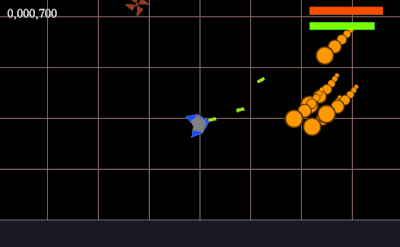

# Space Shooter

## Running

Use Visual Studio (the [Community](https://www.visualstudio.com/vs/community/) edition is sufficient) to open the solution file in `Projects\Visual Studio 2015`. Make sure `Game` is set as the startup project and run. The compiled binary will be placed in the `Binary` directory in the root of the project.

## Controls

Accelerate by pressing the <kbd>&uarr;</kbd> key and turn left and right using the <kbd>&larr;</kbd> and <kbd>&rarr;</kbd> keys. Shoot enemies with the laser gun by holding the <kbd>z</kbd> key. Shooting will deplete your energy (green bar at the top-right); you will need to stop shooting for a short while to allow the energy to refill. The red bar the the top-right is your health and it decreases whenever an enemy hits you. Your score is in the top-left corner and it increases with every enemy you kill.  
